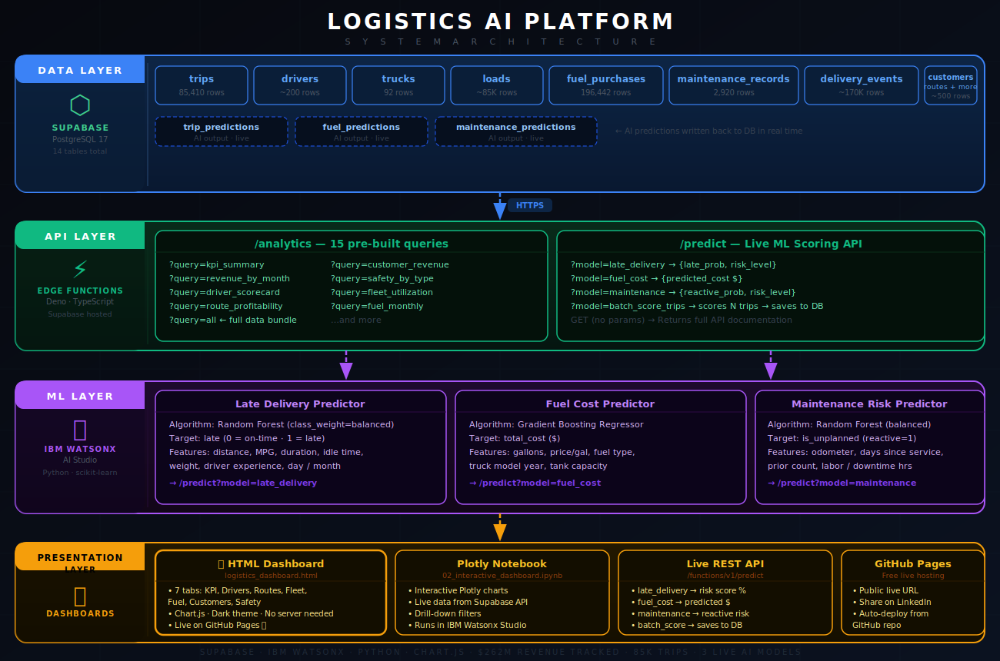

# 🚛 Logistics AI Platform

A full-stack logistics analytics and machine learning platform built on **Supabase PostgreSQL**, **IBM Watsonx**, and **Python**. Tracks $262M+ in freight revenue, scores 85,000+ trips with live AI predictions, and exposes a REST API for real-time decision making.

🌐 **[View Live Dashboard](dashboard/logistics_dashboard.html)** ← update after GitHub Pages setup

---

## 📸 Dashboard Preview

> Open `dashboard/logistics_dashboard.html` in any browser no server or installation needed.
> 7 tabs: KPI Summary · Drivers · Routes · Fleet · Fuel · Customers · Safety

---

## 🏗️ Architecture



```
┌─────────────────────────────────────────────────────┐
│  DATA LAYER — Supabase PostgreSQL 17                │
│  14 tables · 300K+ records · 3 live AI output tables│
└────────────────────┬────────────────────────────────┘
                     │ HTTPS
┌────────────────────▼────────────────────────────────┐
│  API LAYER — Supabase Edge Functions (Deno/TS)      │
│  /analytics → 15 pre-built SQL queries              │
│  /predict   → 3 live ML scoring endpoints           │
└────────────────────┬────────────────────────────────┘
                     │
┌────────────────────▼────────────────────────────────┐
│  ML LAYER — IBM Watsonx AI Studio (Python)          │
│  Late Delivery · Fuel Cost · Maintenance Risk       │
└────────────────────┬────────────────────────────────┘
                     │
┌────────────────────▼────────────────────────────────┐
│  PRESENTATION — HTML Dashboard + REST API           │
│  Chart.js dashboard · GitHub Pages · Live API       │
└─────────────────────────────────────────────────────┘
```

---

## 📊 Key Metrics

| Metric | Value |
|--------|-------|
| Total Revenue Tracked | $262,525,800 |
| Completed Trips | 85,410 |
| Active Trucks | 92 |
| Fleet Avg MPG | 6.50 |
| Fuel Purchase Records | 196,442 |
| Maintenance Records | 2,920 |
| AI Predictions | Live (saved to DB) |

---

## 🤖 Machine Learning Models

### Model 1 — Late Delivery Predictor
- **Algorithm:** Random Forest Classifier (`class_weight="balanced"`)
- **Target:** Will this trip be late? (0 = On-time, 1 = Late)
- **Features:** Distance, MPG, duration, idle time, day of week, month, weight, driver experience, load type
- **API:** `POST /predict?model=late_delivery`

### Model 2 — Fuel Cost Predictor
- **Algorithm:** Gradient Boosting Regressor
- **Target:** Predicted total fuel cost ($)
- **Features:** Gallons, price per gallon, month, fuel type, truck model year, tank capacity
- **API:** `POST /predict?model=fuel_cost`

### Model 3 — Maintenance Risk Predictor
- **Algorithm:** Random Forest Classifier (`class_weight="balanced"`)
- **Target:** Will next maintenance be reactive/unplanned? (0 = Routine, 1 = Reactive)
- **Features:** Model year, odometer, days since last service, prior maintenance count, labor hours
- **API:** `POST /predict?model=maintenance`

---

## 🔌 Live Prediction API

Base URL: `https://wwuayfcusssjethadjfk.supabase.co/functions/v1/predict`

```bash
# Predict late delivery risk for a trip
curl -X POST "BASE_URL?model=late_delivery" \
  -H "Content-Type: application/json" \
  -d '{"actual_distance_miles": 520, "average_mpg": 6.2, "actual_duration_hours": 9.5}'

# Response:
# {"late_probability": 0.73, "risk_level": "HIGH", "model_version": "1.0"}
```

| Endpoint | Method | Description |
|----------|--------|-------------|
| `?model=late_delivery` | POST | Trip → Late risk % + LOW/MEDIUM/HIGH |
| `?model=fuel_cost` | POST | Gallons + price → Predicted cost $ |
| `?model=maintenance` | POST | Truck details → Reactive risk % |
| `?model=batch_score_trips` | POST | Score N trips, save to DB |

---

## 📁 Project Structure

```
logistics-ai-platform/
│
├── README.md
├── .gitignore
│
├── notebooks/
│   ├── 01_data_exploration.ipynb        # EDA + matplotlib charts
│   ├── 02_interactive_dashboard.ipynb   # Plotly interactive dashboard
│   ├── 03_ai_models.ipynb               # ML model training & evaluation
│   ├── 04_model_deployment.ipynb        # Live API scoring + batch predictions
│   └── 05_autoai_experiment.ipynb       # IBM AutoAI pipeline design
│
├── dashboard/
│   └── logistics_dashboard.html         # Standalone browser dashboard (Chart.js)
│
└── docs/
    └── architecture_diagram.svg          # System architecture visual
```

---

## 🛠️ Tech Stack

| Layer | Technology |
|-------|-----------|
| Database | Supabase (PostgreSQL 17) |
| API / Backend | Supabase Edge Functions (Deno + TypeScript) |
| ML Platform | IBM Watsonx AI Studio |
| ML Libraries | scikit-learn, pandas, numpy, matplotlib |
| Interactive Viz | Plotly, Chart.js |
| Frontend Dashboard | HTML5, CSS3, JavaScript |
| Hosting | GitHub Pages (free) |
| Language | Python 3.11, TypeScript |

---

## 🚀 Getting Started

### 1. Clone the repo
```bash
git clone https://github.com/YOUR_USERNAME/logistics-ai-platform.git
cd logistics-ai-platform
```

### 2. View the dashboard instantly
Open `dashboard/logistics_dashboard.html` in any browser — no setup required.

### 3. Run the notebooks
Install dependencies:
```bash
pip install pandas numpy scikit-learn matplotlib plotly requests seaborn
```
Then open IBM Watsonx, upload the notebooks from the `notebooks/` folder, and run in order (01 → 04).

### 4. Set your credentials
In each notebook, replace the placeholder values:
```python
SUPABASE_URL      = 'https://YOUR_PROJECT.supabase.co/functions/v1/analytics'
SUPABASE_ANON_KEY = 'YOUR_ANON_KEY'
WML_CREDENTIALS   = {'url': '...', 'apikey': 'YOUR_IBM_API_KEY'}
PROJECT_ID        = 'YOUR_WATSONX_PROJECT_ID'
```

---

## 📋 Database Schema (14 Tables)

| Table | Records | Description |
|-------|---------|-------------|
| `trips` | 85,410 | All freight trips with timing & performance |
| `drivers` | ~200 | Driver profiles, experience, CDL class |
| `trucks` | 92 | Fleet inventory, model year, fuel type |
| `trailers` | ~150 | Trailer inventory and specs |
| `loads` | ~85K | Load details, weight, revenue |
| `customers` | ~500 | Customer accounts and revenue |
| `routes` | ~300 | Origin-destination route definitions |
| `facilities` | ~100 | Terminal and facility locations |
| `fuel_purchases` | 196,442 | All fuel transactions |
| `maintenance_records` | 2,920 | Full maintenance history |
| `delivery_events` | ~170K | On-time/late delivery events |
| `safety_incidents` | — | Safety incident records |
| `trip_predictions` | Live | AI late delivery scores |
| `maintenance_predictions` | Live | AI maintenance risk scores |

---

## 👤 Author

Built by **Mark Ochwada**
- LinkedIn: https://www.linkedin.com/in/mark-ochwada-b3a1b3198/
- GitHub: https://github.com/Mochwada

---

## 📄 License

MIT License — free to use, modify, and share with attribution.
